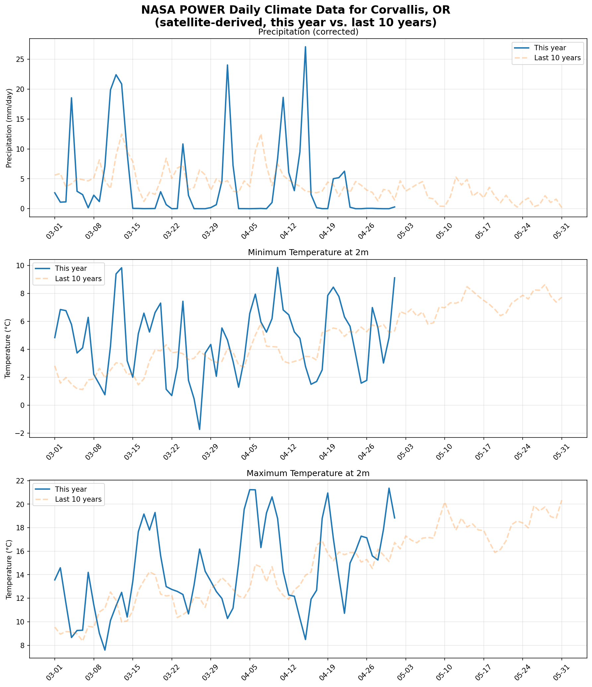
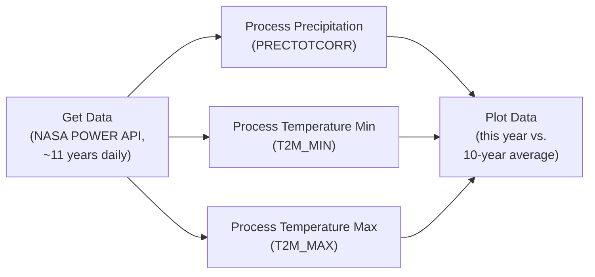

# NASA POWER Visualization Workflow



## Table of Contents

- [Key Topics](#key-topics)
- [Introduction](#introduction)
- [Prerequisites](#prerequisites)
- [Understanding our Data](#understanding-our-data)
- [Writing our Functions](#writing-our-functions)
  - [1. Get our Data](#1-get-our-data)
  - [2. Process our Data](#2-process-our-data)
  - [3. Plot our Data](#3-plot-our-data)
- [Building our Workflow](#building-our-workflow)
  - [1. Set Up our Compute Server](#1-set-up-our-compute-server)
  - [2. Set Up our Data Store](#2-set-up-our-data-store)
  - [3. Add our Functions](#3-add-our-functions)
    - [Get Data Function](#get-data-function)
    - [Process Data Functions](#process-data-functions)
    - [Plot Data Function](#plot-data-function)
  - [4. Connect our Functions](#4-connect-our-functions)
  - [5. Finalize our Workflow Configuration](#5-finalize-our-workflow-configuration)
- [Download and Invoke the Workflow](#download-and-invoke-the-workflow)
  - [Register and Invoke the Workflow](#register-and-invoke-the-workflow)
  - [View the Output Data](#view-the-output-data)
- [Verifying the Workflow Locally](#verifying-the-workflow-locally)
- [Choosing Dates and Locations](#choosing-dates-and-locations)
- [Troubleshooting](#troubleshooting)
- [Extending this Example](#extending-this-example)
- [Summary](#summary)

## Key Topics

This example demonstrates:

- Writing FaaSr functions in Python
- Fetching data from an open (keyless) REST API
- Converting a JSON API response to CSV for pandas processing
- Invoking multiple functions in parallel (fan-out)
- Duplicating one function across actions with different arguments
- Fan-in: an action that waits for multiple predecessors
- Handling missing data (NASA POWER fill values)
- Adding Python packages (pandas, matplotlib)

## Introduction

The NASA POWER Visualization Workflow pulls satellite-derived daily climate data from the [NASA POWER API](https://power.larc.nasa.gov/), processes it in parallel, and creates a visualization comparing this year's weather to the average of the last 10 years.

This example is the satellite counterpart of the [Weather Visualization Workflow](https://github.com/FaaSr/FaaSr-Functions/tree/main/WeatherVisualization): the DAG structure, the processing logic, and the final plot are the same, but the NOAA GHCND station dataset is replaced by NASA POWER satellite data. Where GHCND requires a weather station near your location of interest, NASA POWER provides data for **any coordinate worldwide**, with **no API key and no signup**. Both examples use the same default location (Corvallis, OR), so their outputs are directly comparable — station measurements vs. satellite estimates of the same place.

The workflow structure:



The three process actions all run the **same function** (`compare_to_yearly_average`) with a different `column_name` argument — the FaaSr "duplicate function" pattern. The plot action is a **fan-in**: FaaSr invokes it only after all three process actions complete.

## Prerequisites

This example assumes you have completed the [FaaSr tutorial](https://faasr.io/tutorial/) and have a FaaSr-workflow repository set up with GitHub Actions enabled and the secrets `GH_PAT`, `S3_AccessKey`, and `S3_SecretKey` configured. Unlike API examples that require credentials, NASA POWER needs **no API signup step**.

## Understanding our Data

The [NASA POWER](https://power.larc.nasa.gov/) (Prediction Of Worldwide Energy Resources) project provides satellite-derived daily climate data tailored for agriculture, renewable energy, and infrastructure research. The daily point endpoint takes a coordinate and a date range:

```text
https://power.larc.nasa.gov/api/temporal/daily/point?parameters=PRECTOTCORR,T2M_MIN,T2M_MAX&community=AG&longitude=-123.2620&latitude=44.5646&start=20150101&end=20260515&format=JSON
```

You can open that URL in a browser right now — no key needed — and see the raw data this workflow consumes.

The three parameters map 1:1 to the columns used in the GHCND example:

| NASA POWER | GHCND equivalent | Meaning | Units |
|---|---|---|---|
| `PRECTOTCORR` | `PRCP` | Corrected total precipitation | mm/day |
| `T2M_MIN` | `TMIN` | Minimum temperature at 2 meters | °C |
| `T2M_MAX` | `TMAX` | Maximum temperature at 2 meters | °C |

Differences from GHCND worth knowing before reading the code:

- **GeoJSON response.** Data lives under `properties.parameter` as `{ "YYYYMMDD": value }` maps — one map per parameter — rather than CSV rows. Our GetData function converts this to a GHCND-style CSV so the downstream processing is identical to the original example.
- **Real units.** Values arrive in mm/day and °C directly. (GHCND reports tenths, requiring division by 10 in the plot step — that conversion is *removed* in this example.)
- **Fill values.** Days not yet processed by the satellite pipeline are reported as `-999.0` (declared in the response's `header.fill_value`). The most recent ~2–4 weeks are typically unavailable. GetData writes these as empty CSV cells and processing drops them.
- **`community=AG`** selects the Agroclimatology parameter community (alternatives: `RE` renewable energy, `SB` sustainable buildings). The full parameter dictionary is at [power.larc.nasa.gov/parameters](https://power.larc.nasa.gov/parameters/).

The default location is Corvallis, OR (44.5646, -123.2620) — the same location as the GHCND example's station `USC00351862`.

## Writing our Functions

The workflow uses three functions, found in the [python](./python/) folder.

### 1. Get our Data

The complete function is in [01_get_data.py](./python/01_get_data.py). It downloads ~11 years of daily data in a single API call, converts the JSON to CSV, and uploads it to the S3 bucket.

The imports — note there is no secrets stub, because no API key exists:

```python
import requests
from FaaSr_py.client.py_client_stubs import faasr_log, faasr_put_file
```

The URL builder takes coordinates and a date window instead of a station ID:

```python
def build_url(lat: str, lon: str, start: str, end: str) -> str:
    base_url = "https://power.larc.nasa.gov/api/temporal/daily/point"
    return (
        f"{base_url}?parameters=PRECTOTCORR,T2M_MIN,T2M_MAX&community=AG"
        f"&longitude={lon}&latitude={lat}&start={start}&end={end}&format=JSON"
    )
```

The conversion step pivots NASA's per-parameter date maps into GHCND-style rows, turning fill values into empty cells:

```python
def fmt(value) -> str:
    if value is None or value == fill_value:
        return ""
    return str(value)

with open(output_name, "w") as f:
    f.write("DATE,PRECTOTCORR,T2M_MIN,T2M_MAX\n")
    for date_key in sorted(precip.keys()):
        iso_date = f"{date_key[0:4]}-{date_key[4:6]}-{date_key[6:8]}"
        ...
```

**Key Points:**

- One API call covers the full ~11-year window (the current period plus 10 prior years) — about 4,100 daily rows
- Dates are converted from NASA's `YYYYMMDD` keys to ISO `YYYY-MM-DD` so the date-slicing logic from the GHCND example works unchanged
- A 120-second timeout protects against a slow response on the large payload
- The CSV is uploaded with `faasr_put_file()` — this is how data passes to the next steps; nothing is kept in memory between actions

### 2. Process our Data

The complete function is in [02_process_data.py](./python/02_process_data.py). The logic is intentionally identical to the GHCND example's `compare_to_yearly_average`:

1. Download the CSV from the bucket with `faasr_get_file()`
2. **Current year:** slice the rows between `start` and `end`, keep the day-of-year (`MM-DD`) and the value column
3. **Previous years:** for each of the 10 prior years, slice the same period **plus 30 days**, then average each day-of-year across the years
4. Upload two CSVs: `current_year_<output_name>` and `previous_years_<output_name>`

The 30-day extension on previous years makes the historical average line extend past the current data in the plot — useful for seeing what's typically ahead.

The only addition relative to the GHCND original is one line handling satellite fill values:

```python
# Drop days where the satellite product is not yet available (empty cells)
current_year = current_year.dropna(subset=[column_name])
```

**Key Points:**

- **This single function is registered three times** — as ProcessPrecipitation, ProcessTemperatureMin, and ProcessTemperatureMax — differing only in their `column_name` and `output_name` arguments. This is FaaSr's function-duplication pattern: one piece of code, multiple parallel actions
- `pandas` does the date slicing and group-by averaging; it must be declared in the workflow's Python packages for this function
- The previous-years average uses `groupby("DAY").mean()`, which skips missing values automatically

### 3. Plot our Data

The complete function is in [03_plot_data.py](./python/03_plot_data.py). This is the fan-in step: it runs only after all three process actions complete, downloads all six processed CSVs, merges them on day-of-year, and draws three stacked subplots — this year at full opacity, the 10-year average dashed at 30% opacity.

```python
import matplotlib

matplotlib.use("Agg")  # headless backend for container execution
import matplotlib.pyplot as plt
```

**Key Points:**

- `matplotlib.use("Agg")` must come *before* importing `pyplot` — the FaaSr container has no display
- The GHCND example's divide-by-10 unit conversion is **removed**: NASA POWER values are already in mm/day and °C
- Leap days (`02-29`) are dropped so day-of-year merges align across years
- Output is a single PNG uploaded to the bucket — the workflow's final artifact

## Building our Workflow

The complete workflow file is [NASAPowerVisualization.json](./NASAPowerVisualization.json). You can build it by hand, or with the [FaaSr Workflow Builder](https://faasr.io/FaaSr-workflow-builder/) GUI as described below. Either way, the result is the same JSON.

### 1. Set Up our Compute Server

In the Workflow Builder, click **Edit Compute Servers** and configure the GitHub Actions server (named `GH`):

- **UserName**: your GitHub username
- **ActionRepoName**: the name of your FaaSr-workflow repository (where the register/invoke actions and secrets live)
- **Branch**: `main`
- **UseSecretStore**: `true` — required for the entry action; invoke fails with `UseSecretStore must be true for initial action` without it

### 2. Set Up our Data Store

Click **Edit Data Stores** and configure the S3 store (named `S3`):

- **Endpoint**: `https://play.min.io`
- **Bucket**: `faasr`
- **Region**: `us-east-1`

MinIO Play is a free public sandbox — note that it **periodically wipes all data**, so download outputs you want to keep.

### 3. Add our Functions

Create five actions. For all of them: **Language** = `Python`, **Compute Server** = `GH`, and **Function's Git Repo/Path** = this repository (`<your-username>/FaaSr-NASA-Functions/python`).

#### Get Data Function

- **Action Name**: `GetData` · **Function Name**: `get_nasa_power_data`
- Arguments:
  - `folder_name`: `NASAPowerVisualization`
  - `output_name`: `NASAPowerData.csv`
  - `lat`: `44.5646` · `lon`: `-123.2620`
  - `start`: `20150101` · `end`: `20260515`
  - `location_name`: `Corvallis, OR`

#### Process Data Functions

Create **three** actions, all with **Function Name** `compare_to_yearly_average` and Python package `pandas`. They share `folder_name`: `NASAPowerVisualization`, `input_name`: `NASAPowerData.csv`, `start`: `2026-03-01`, `end`: `2026-05-01`, and differ in:

| Action Name | `column_name` | `output_name` |
|---|---|---|
| `ProcessPrecipitation` | `PRECTOTCORR` | `PrecipitationData.csv` |
| `ProcessTemperatureMin` | `T2M_MIN` | `TemperatureMinData.csv` |
| `ProcessTemperatureMax` | `T2M_MAX` | `TemperatureMaxData.csv` |

#### Plot Data Function

- **Action Name**: `PlotData` · **Function Name**: `plot_weather_comparison` · Python packages: `pandas`, `matplotlib`
- Arguments:
  - `folder_name`: `NASAPowerVisualization`
  - `input_precip_name`: `PrecipitationData.csv`
  - `input_min_temp_name`: `TemperatureMinData.csv`
  - `input_max_temp_name`: `TemperatureMaxData.csv`
  - `location`: `Corvallis, OR`
  - `output_name`: `NASAPowerComparison.png`

### 4. Connect our Functions

Define the DAG with **InvokeNext**:

- `GetData` → `ProcessPrecipitation`, `ProcessTemperatureMin`, `ProcessTemperatureMax` (parallel fan-out)
- each process action → `PlotData` (fan-in: PlotData waits for all three)

### 5. Finalize our Workflow Configuration

In **Workflow Settings**:

- **Workflow Name**: `NASAPowerVisualization`
- **Entry Point**: `GetData`

No workflow secrets are needed — the API is open. Download the JSON.

## Download and Invoke the Workflow

Upload `NASAPowerVisualization.json` to your FaaSr-workflow repository (the same repository named in `ActionRepoName`).

### Register and Invoke the Workflow

1. In your FaaSr-workflow repository, go to the **Actions** tab
2. Select **(FAASR REGISTER)** → **Run workflow** → enter `NASAPowerVisualization.json` → Run, and wait for it to complete
3. Five new workflows appear: `NASAPowerVisualization-GetData`, `-ProcessPrecipitation`, `-ProcessTemperatureMin`, `-ProcessTemperatureMax`, `-PlotData`
4. Select **(FAASR INVOKE)** → **Run workflow** → enter `NASAPowerVisualization.json` → Run
5. Watch the five actions run in DAG order: GetData first, the three process actions in parallel, then PlotData

If you change the JSON later, run **(FAASR REGISTER)** again before invoking.

### View the Output Data

1. Open the MinIO Play console: <https://play.min.io:9443/login> (username = `S3_AccessKey` value, password = `S3_SecretKey` value)
2. Navigate to bucket `faasr` → folder `NASAPowerVisualization`
3. You should see eight files:

```text
faasr/NASAPowerVisualization/
├── NASAPowerData.csv                      (raw converted data, ~4,100 rows)
├── current_year_PrecipitationData.csv
├── previous_years_PrecipitationData.csv
├── current_year_TemperatureMinData.csv
├── previous_years_TemperatureMinData.csv
├── current_year_TemperatureMaxData.csv
├── previous_years_TemperatureMaxData.csv
└── NASAPowerComparison.png                (final visualization)
```

4. Download `NASAPowerComparison.png` — the example at the top of this README shows what it looks like

## Verifying the Workflow Locally

Because the functions only touch FaaSr through `faasr_get_file` / `faasr_put_file` / `faasr_log`, they can be tested on a laptop by mocking those three stubs with local file copies. A run of the same three functions with the same arguments against the live API produces the same plot as the FaaSr run (modulo NASA's daily data backfill). This is a useful pattern for any FaaSr workflow: validate the Python locally first, so cloud failures can only be configuration issues.

## Choosing Dates and Locations

- `start`/`end` in **GetData** (`YYYYMMDD`) define the full download window — it must cover the current period *and* the same period (+30 days) in each of the 10 prior years
- `start`/`end` in the **process actions** (`YYYY-MM-DD`) define the current period being compared
- End the current period at least ~3 weeks before today: NASA's satellite products lag real time, and more recent days are fill values (the workflow tolerates this — the current-year line simply stops earlier, as visible in the example output)
- Any coordinate on Earth works: change `lat`/`lon`/`location_name` in GetData and `location` in PlotData. For example, the SD-6 LEMA region in Kansas is `lat: 38.5`, `lon: -98.5`

## Troubleshooting

1. **Invoke fails with `UseSecretStore must be true for initial action`** — add `"UseSecretStore": true` to the `GH` block under `ComputeServers` in the JSON, then re-register
2. **GetData times out** — an 11-year daily request is a large payload (120s timeout configured); shorten the window or retry
3. **Current-year line is short or empty** — the period's recent days are still fill values; move the process actions' `end` date earlier
4. **Plot action import error** — confirm `pandas` and `matplotlib` are listed under `PyPIPackageDownloads` for the correct function names
5. **Register fails writing actions** — confirm `ActionRepoName`/`UserName` in the JSON match the repository that holds your secrets and FaaSr actions
6. **Output folder is empty in MinIO** — MinIO Play wipes data periodically; re-run **(FAASR INVOKE)** to regenerate

## Extending this Example

The original [Weather Visualization Workflow](https://github.com/FaaSr/FaaSr-Functions/tree/main/WeatherVisualization) includes two follow-on tutorials that apply equally to this workflow:

- **Conditional workflow** — have a function return `True`/`False` and branch the DAG on the result (e.g., fetch a second location only if the first succeeds)
- **Custom data stores** — replace MinIO Play with your own S3-compatible bucket (e.g., Backblaze B2) by adding a second entry under `DataStores` and per-store credentials

Both require only JSON changes plus small function edits, following the patterns documented there.

## Summary

In this tutorial, you learned how to:

✓ Fetch satellite climate data for any coordinate from an open, keyless API
✓ Convert a JSON REST response to CSV for pandas processing
✓ Fan a workflow out into three parallel actions running one duplicated function
✓ Fan back in to a plot action that waits for all predecessors
✓ Handle near-real-time satellite fill values
✓ Register, invoke, and verify a FaaSr workflow end to end
